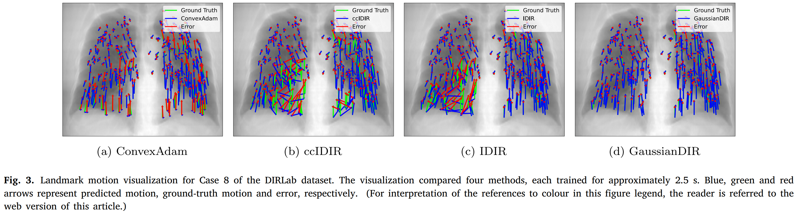

<div align="center">

# Gaussian Primitives for Deformable Image Registration

[](https://doi.org/10.1016/j.phro.2025.100821)
[](https://www.python.org/)
[](https://pytorch.org/)

**Jihe Li**\*, **Xiang Liu**\*, Fabian Zhang, Xixin Cao, Joachim M. Buhmann, Ye Zhang, Xia Li†

<sub>\* Equal contribution &nbsp;•&nbsp; † Corresponding author &nbsp;•&nbsp; Physics and Imaging in Radiation Oncology, 2025</sub>

</div>

<p align="center">
  
</p>

> **GaussianDIR** is a case-specific optimization method for deformable image registration. It represents
> the deformation field with a sparse set of mobile and flexible Gaussian primitives, each defined by a
> center position, a covariance and a local transformation.

---

## Contents

1. [Installation](#installation)
2. [Data Preparation](#data-preparation)
3. [Optimization](#optimization)
4. [Inference](#inference)
5. [Results](#results)
6. [Citation](#citation)

## Installation

**1. Create a conda environment.**

```bash
conda create -n gaussian python=3.12
conda activate gaussian
```

**2. Install PyTorch** following the official documentation for your CUDA version.

```bash
conda install pytorch torchvision torchaudio pytorch-cuda=12.1 -c pytorch -c nvidia
```

**3. Install PyTorch3D**, used for the K-NN lookup of the Gaussian primitives. Download the
[matching package](https://anaconda.org/pytorch3d/pytorch3d/0.7.8/download/linux-64/pytorch3d-0.7.8-py312_cu121_pyt241.tar.bz2)
and install it from the local file.

```bash
conda install /path/to/pytorch3d-0.7.8-py312_cu121_pyt241.tar.bz2
```

**4. Install the remaining requirements.**

```bash
pip install -r requirements.txt
```

## Data Preparation

| Dataset | Modality | Evaluated with | Download |
| :-- | :-- | :-- | :-- |
| **DIR-Lab 4DCT** | Lung CT | TRE on 300 landmarks | [link](https://med.emory.edu/departments/radiation-oncology/research-laboratories/deformable-image-registration/index.html) |
| **OASIS** | Brain MRI | Dice, HD95 on 35 labels | [link](https://github.com/adalca/medical-datasets/blob/master/neurite-oasis.md) |
| **ACDC** | Cardiac MRI | Dice, HD95 | [link](https://www.creatis.insa-lyon.fr/Challenge/acdc/) |

Convert the volumes to NIfTI and place them into the folder `data` following the layout below. The
folder of each dataset can be changed in `configs/dataset/loader/<dataset>.yaml`.

<details>
<summary><b>Expected folder layout</b></summary>

```text
data/DIRLab/Case<i>Pack/            # i = 1 … 10, T00 is fixed and T50 is moving
├── Images/case<i>_T<p>0.nii.gz     # p = 0 … 5
├── Lungs/case<i>_T<p>0.nii.gz      # lung mask, used as the region of interest
├── Bodies/case<i>_T<p>0.nii.gz     # body mask, used when only_lung=false
├── OARs/case<i>_T<p>0.nii.gz       # organs at risk
└── ExtremePhases/Case<i>_300_T<p>0_xyz.txt   # 300 landmarks

data/OASIS/                         # case index 0 … 19, the pairs of the validation split
├── pairs_val.csv
└── OASIS_OAS1_<id>_MR1/{aligned_norm,aligned_seg35,aligned_ROI}.nii.gz

data/ACDC/patient<100+i>/           # i = 1 … 50, ED is fixed and ES is moving
└── patient<100+i>_E{D,S}{,_gt}.nii.gz
```

</details>

## Optimization

Optimize the Gaussian representation of a single case.

```bash
python train.py dataset.case_idx=1
```

Every entry of `configs/gaussian.yaml` can be overridden on the command line, so another dataset is a
matter of selecting its loader.

```bash
python train.py dataset/loader=oasis dataset.case_idx=0 exp_name=GaussianDIR-OASIS
python train.py dataset/loader=acdc  dataset.case_idx=1 exp_name=GaussianDIR-ACDC
```

Optimize all the cases of DIR-Lab one after another.

```bash
bash scripts/run.sh
```

## Inference

Evaluate a case and export the results.

```bash
python inference.py dataset.case_idx=1
```

The command reports the target registration error on DIR-Lab, the Dice score and the 95th percentile
Hausdorff distance on OASIS and ACDC, and the mean absolute error and the folding rate on all the
datasets. The exports are written to the `results` subfolder.

```text
outputs/GaussianDIR/Case1/results/
├── flow.nii.gz          # deformation field
├── warped_img.nii.gz    # warped moving image
└── warped_seg.nii.gz    # warped moving segmentation
```

## Results

Target registration error on the ten DIR-Lab cases, obtained with the default configuration
(`configs/gaussian.yaml`).

| Case | 1 | 2 | 3 | 4 | 5 | 6 | 7 | 8 | 9 | 10 | **Mean** |
| :-- | --: | --: | --: | --: | --: | --: | --: | --: | --: | --: | --: |
| TRE (mm) | 0.78 | 0.75 | 0.94 | 1.25 | 1.11 | 0.96 | 0.93 | 1.10 | 1.00 | 0.92 | **0.97** |

## Citation

If you find this work useful, please consider citing:

```bibtex
@article{li2025gaussian,
   title={Gaussian primitives for deformable image registration},
   author={Li, Jihe and Liu, Xiang and Zhang, Fabian and Cao, Xixin and Buhmann, Joachim M. and Zhang, Ye and Li, Xia},
   journal={Physics and Imaging in Radiation Oncology},
   year={2025},
   volume={35},
   pages={100821},
   doi={10.1016/j.phro.2025.100821}
}
```
